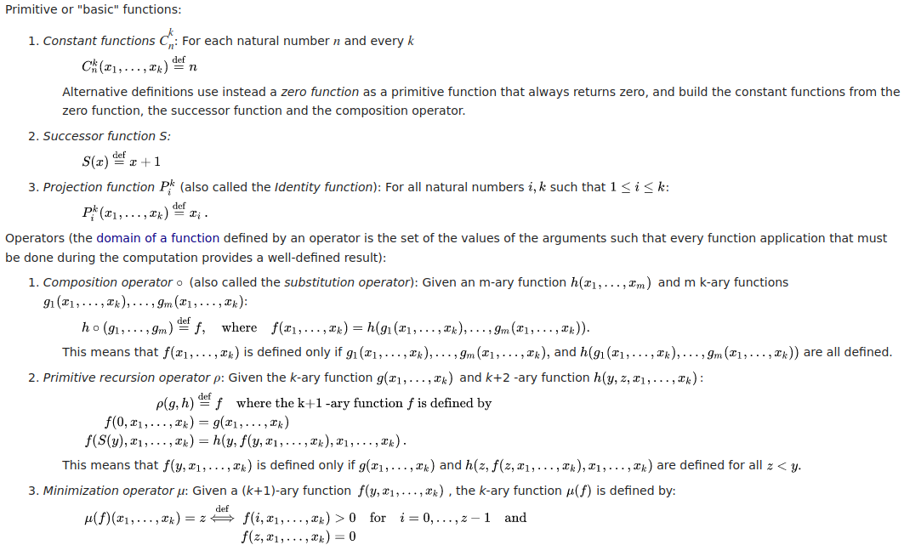

# General recursive functions

What are they? A general recursive function or grf is a class of functions whose input is a k-tuple of natural numbers, and whose output is a single natural number. More precisely it be defined as [(courtesy of wikipedia)](https://en.wikipedia.org/wiki/General_recursive_function):

Interestingly, grfs are turing complete. By making the 3 basic functions and operators features of a language, we get a turing complete albeit somewhat esoteric programming language. That's precisely what this is. These features have the following syntax...

## Syntax

PROGRAM ::= newline PROGRAM \
    |  DEFINITION PROGRAM \
    | comment PROGRAM

DEFINITION ::= identifier = FUNCTION

FUNCTION ::= integer \
    | proj integer integer \
    | suc \
    | comp(FUNCTION{,FUNCTION}) \
    | rec(FUNCTION,FUNCTION) \
    | min(FUNCTION)

Note how for constant functions you just write an integer, there's no keyword, nor do you specify the arity as this can be infered.

A comment begins // and ends with at the first newline character. Identifiers can contain alphanumeric characters and underscores, and must not start with a digit. Integers are strictly non-negative. Spaces can seperate tokens but are otherwise filtered out. Example programs can be found in the compile_test folder.

## Tools used

This project was done in golang because of well go routines and channels work with the multi-pass architechture of a compiler. The compiler generates llvm intermediate representation using the [llir](https://github.com/llir/llvm) package. The resulting ir is assembled using [Clang](https://clang.llvm.org/).